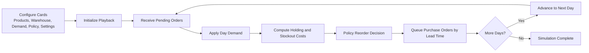

# Inventory Management Simulation

An inventory management simulation application for optimizing stocking strategies. This project models the supply chain lifecycle, including products, variable demand, warehouse operations, and inventory policies, with an interactive UI and data visualizations.

## Project Structure

The project is structured into three main layers:

- **Engine (`src/engine/`)**: The core simulation logic handling `demand`, `policies`, `product`, `simulator`, and `warehouse`.
- **UI (`src/ui/`)**: The user interface components for interacting with the simulation (`dashboard`, `configPanel`, `resultsPanel`, and `animations`).
- **Charts (`src/charts/`)**: Data visualization modules to graph simulation results.

## Prerequisites

Make sure you have [Node.js](https://nodejs.org/) installed on your machine.

## Getting Started

1. **Install dependencies**
   ```bash
   npm install
   ```

2. **Run the development server**
   ```bash
   npm run dev
   ```
   Open the provided local URL in your browser to interact with the simulation.

3. **Build for production**
   ```bash
   npm run build
   ```
   The built files will be output to the `dist` directory.

4. **Preview the production build locally**
   ```bash
   npm run preview
   ```

## Technologies Used

- Vanilla JavaScript (ES Modules)
- CSS for styling
- [Vite](https://vitejs.dev/) for fast development and bundling

## Process Flow (Cards to Simulation)



## Day-by-Day Playback Controls

On the **Simulate** tab, the **Process Flow + Day Playback** card now supports:

- `Initialize Playback`: prepares a single day-by-day run using current card settings.
- `Next Day (Manual)`: advances exactly one simulation day each click.
- `Start Auto Day`: runs days continuously until complete (or paused).
- `Auto Speed`: choose `0.5x`, `1x`, `2x`, `4x`, or `8x` to control playback speed.

This playback mode is for interactive understanding of the process. The existing **Run Simulation** button still executes Monte Carlo runs for aggregated strategy results.
